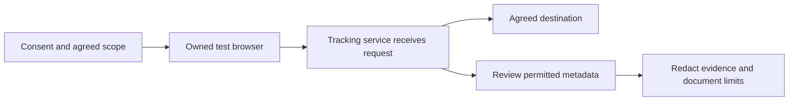

<div align="center">

# Grabify Tracking-Link Security Demo

### Jeffrey Beckett · Cybersecurity Portfolio

**A defensive look at link tracking, network metadata, and privacy awareness.**


<br /><br />


*Understand what a link visit can reveal—and how to interpret the evidence responsibly.*

[Overview](#overview) · [Workflow](#authorized-lab-workflow) · [IP addresses](#public-vs-private-ip) · [Defense](#defensive-takeaways) · [Skills](#skills-demonstrated)

</div>

---

## Overview

This portfolio artifact explains how a tracking-link service can observe a web request before redirecting a browser to an agreed destination. The security lesson is that reaching a legitimate page does not erase the metadata shared with an intermediate service.

The demo is designed for an owned device or an explicitly consenting participant. It emphasizes privacy, evidence interpretation, and defensive investigation. It contains no live tracking links or covert targeting instructions.

> **Evidence status:** This repository is an educational demo narrative. No original lab logs or screenshots were supplied with this edition; the diagram and examples are explanatory, not proof of an executed test. Add only verified, redacted evidence before claiming measured results.

| Project detail | Scope |
| --- | --- |
| Author | Jeffrey Beckett |
| Topic | Tracking links and web-request metadata |
| Environment | Owned device or explicitly authorized lab |
| Deliverable | Illustrated explanation, defensive analysis, evidence template |
| Key question | What does a link visit expose, and what does it **not** establish? |

## Authorized lab workflow



| Stage | Explanation | Defensive interpretation |
| --- | --- | --- |
| 1. Establish scope | Agree on the device, participant, data categories, and retention period. | Make consent specific and informed. |
| 2. Observe the request | The test browser contacts an intermediate service. | That service may receive metadata before the final page loads. |
| 3. Follow the redirect | The browser reaches the agreed destination. | The destination alone does not describe the complete request path. |
| 4. Review evidence | Compare permitted records with the known test conditions. | Distinguish observations from inferred device or location details. |
| 5. Close the lab | Publish only redacted findings and delete raw data according to scope. | Minimize retained personal information. |

## What metadata can be exposed?

Available fields vary with browser behavior, service configuration, and network routing. This table describes possible categories; it is not a claim that every field was collected in this demo.

| Category | What it may tell an analyst | Limits |
| --- | --- | --- |
| Public source IP | The network egress address visible to the service | May belong to a VPN, proxy, shared router, or carrier; does not identify a person by itself. |
| Request timestamp | When a request reached the service | Time zones and automated requests must be considered. |
| User-Agent / browser hints | Browser or operating-system characteristics | Values can be reduced, spoofed, or ambiguous; exact device identity is not guaranteed. |
| IP-based location estimate | An estimated region associated with an address | May be inaccurate; it is not GPS or a home address. |
| Other browser details | Additional fields supported by a particular setup | Document the actual mechanism and consent rather than assuming availability. |

A visit alone does not establish access to passwords, files, a local MAC address, or an exact physical location. Browser geolocation is a separate mechanism that normally requires permission. Link previews, scanners, and bots can also create requests, so a log entry is not automatically proof of a human click.

## Public vs. private IP

```text
Owned device                 Router / NAT                 Internet service
192.168.1.20  ------------>  shared public egress  ------> sees egress address
private LAN address          illustrative: 203.0.113.10
```

*The public address above is reserved for documentation, not an actual lab address.*

| Address type | Where it is used | What a remote website usually sees |
| --- | --- | --- |
| Private IPv4 | Inside a local network: `10.0.0.0/8`, `172.16.0.0/12`, or `192.168.0.0/16` | The translated public egress address, rather than the private LAN address |
| Public IP | Routable Internet connection or an intermediary's egress | The address used to reach the service |

In a typical home IPv4 network, NAT lets multiple devices share a public address. Carrier-grade NAT can extend sharing across customers. VPNs and proxies can change the visible egress address. IPv6 can use globally routable device addresses and does not necessarily follow this IPv4 NAT model.

**Interpretation:** An IP record is a network observation. Reliable attribution requires additional context and authorization.

## Defensive takeaways

| Practice | Why it matters |
| --- | --- |
| Inspect the full hostname and expected destination | Friendly text and shortened URLs can obscure intermediaries. |
| Examine redirects in an approved isolated environment | Redirect history explains which services received requests. |
| Treat link-expansion and scanning tools as active requests | They can trigger tracking, generate logs, or disclose submitted URLs to third parties. |
| Correlate approved browser, DNS, proxy, and endpoint evidence | One timestamp or IP address is insufficient to establish identity or intent. |
| Apply organization-approved filtering and privacy controls | Reduce exposure to unwanted tracking while documenting coverage gaps. |
| Report suspicious links through established channels | Preserve context without spreading a live tracking URL. |

HTTPS protects traffic in transit; it does not prevent the receiving website from observing request metadata. A VPN can change the visible egress address, but it is not a guarantee of anonymity or protection from every tracking technique.

## Ethical scope

- Use only owned devices or participants who explicitly consent to the named service and data categories.
- Set the purpose, permitted observations, retention period, and deletion plan before testing.
- Do not disguise tracking links, target unsuspecting people, or use logs for harassment or identification.
- Redact public IPs, location details, access tokens, dashboard identifiers, and sensitive timestamps before publishing.
- Separate verified observations from interpretations, and record uncertainty.

## Evidence and screenshots

Use the [lab evidence template](docs/lab-evidence-template.md) and [screenshot guide](docs/screenshots/README.md) to add your own authorized results.

| Suggested evidence | What it supports | Publication requirement |
| --- | --- | --- |
| Redacted metadata view | Which fields actually appeared in this test | Remove identifying details and management tokens. |
| Sanitized redirect trace | The request sequence and agreed final destination | Remove live tracking URLs, query secrets, and identifiers. |
| Scope and finding notes | Consent, test conditions, interpretation limits | Exclude participant identities and private records. |

No screenshots are presented as completed evidence in this edition.

## Skills demonstrated

| Skill | How this artifact demonstrates it |
| --- | --- |
| Networking fundamentals | Explains private addressing, NAT, public egress, and IPv6 limits. |
| Web security awareness | Describes HTTP metadata and redirect exposure. |
| Analytical reasoning | Separates observable requests from identity and location assumptions. |
| Privacy and ethics | Defines informed consent, minimization, redaction, and retention. |
| Technical communication | Presents a clear diagram, comparison tables, and a reusable evidence template. |

## Portfolio takeaway

This project demonstrates Jeffrey Beckett's ability to explain a practical privacy risk, interpret network evidence carefully, and communicate defensive lessons. The central takeaway is that a seemingly ordinary link visit can disclose metadata to an intermediary—but that metadata has important attribution limits.

## Repository structure

```text
grabify-tracking-link-security-demo/
├── README.md
├── .gitignore
└── docs/
    ├── lab-evidence-template.md
    ├── visual-provenance.md
    ├── images/
    │   └── grabify-project-overview.png
    └── screenshots/
        └── README.md
```

## Technical references

- [MDN: User-Agent header](https://developer.mozilla.org/en-US/docs/Web/HTTP/Reference/Headers/User-Agent) — browser identification and its limitations.
- [RFC 1918: Address Allocation for Private Internets](https://www.rfc-editor.org/rfc/rfc1918) — private IPv4 address ranges.
- [RFC 5737: IPv4 Address Blocks Reserved for Documentation](https://www.rfc-editor.org/rfc/rfc5737) — safe documentation addresses.

---

<div align="center">

**Jeffrey Beckett · Observe carefully. Interpret responsibly. Defend privacy.**

</div>
